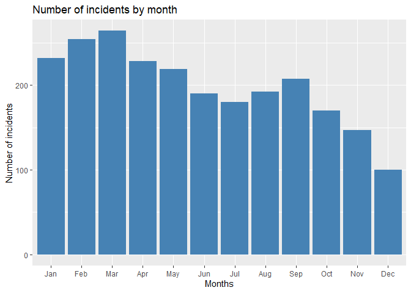
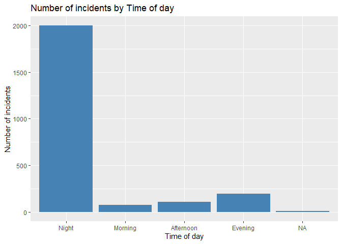
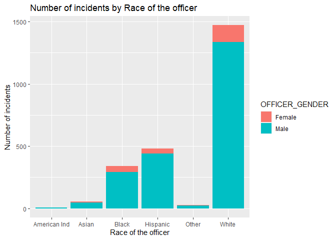
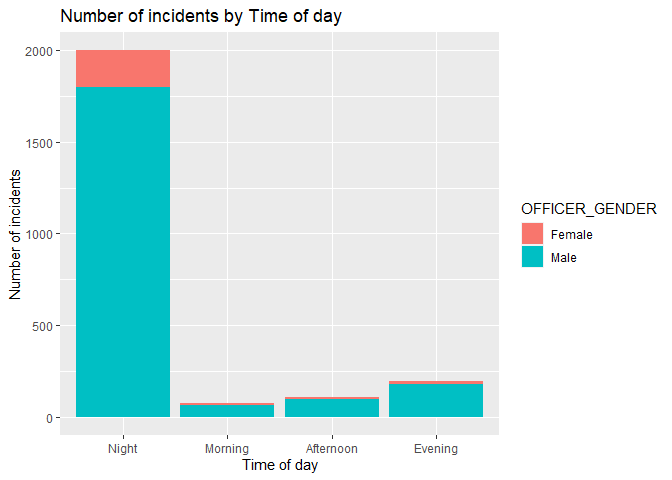
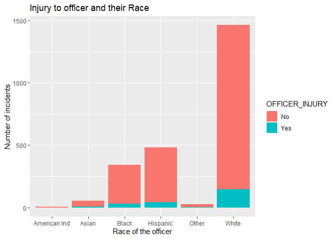
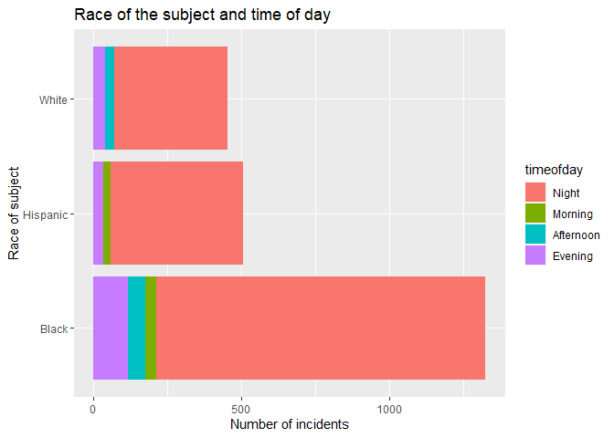
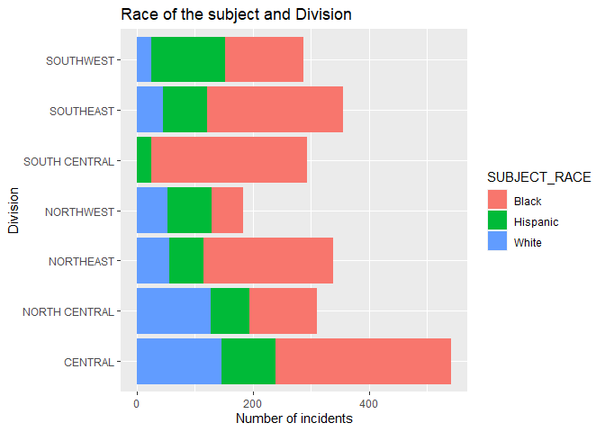
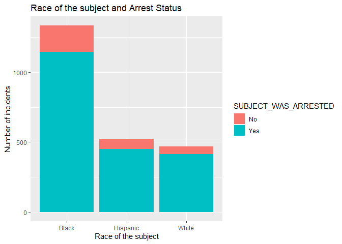
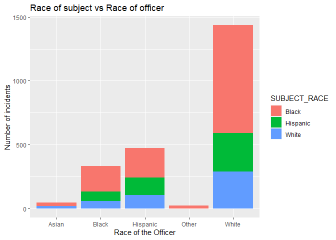
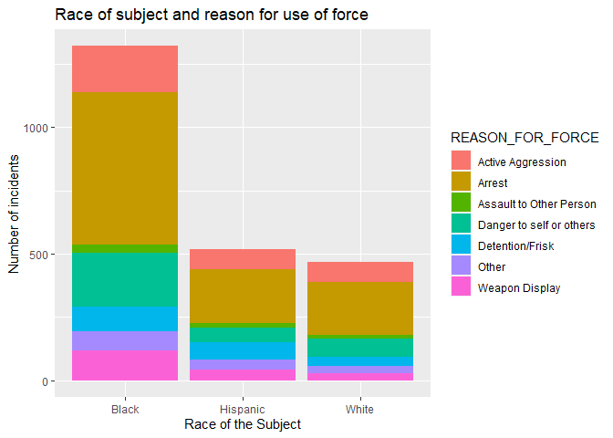

### Libraries needed

    library(tidyverse)

    ## Warning: package 'tidyverse' was built under R version 4.1.3

    ## -- Attaching packages --------------------------------------- tidyverse 1.3.1 --

    ## v ggplot2 3.3.5     v purrr   0.3.4
    ## v tibble  3.1.5     v dplyr   1.0.7
    ## v tidyr   1.1.4     v stringr 1.4.0
    ## v readr   2.1.2     v forcats 0.5.1

    ## Warning: package 'readr' was built under R version 4.1.3

    ## -- Conflicts ------------------------------------------ tidyverse_conflicts() --
    ## x dplyr::filter() masks stats::filter()
    ## x dplyr::lag()    masks stats::lag()

    library(lubridate)

    ## 
    ## Attaching package: 'lubridate'

    ## The following objects are masked from 'package:base':
    ## 
    ##     date, intersect, setdiff, union

### Reading the data

    coe_df <- read.csv("37-00049_UOF-P_2016_prepped.csv", header = T, stringsAsFactors = F)
    head(coe_df)

    ##   INCIDENT_DATE INCIDENT_TIME    UOF_NUMBER OFFICER_ID OFFICER_GENDER
    ## 1    OCCURRED_D    OCCURRED_T        UOFNum CURRENT_BA         OffSex
    ## 2        9/3/16    4:14:00 AM         37702      10810           Male
    ## 3       3/22/16   11:00:00 PM         33413       7706           Male
    ## 4       5/22/16    1:29:00 PM         34567      11014           Male
    ## 5       1/10/16    8:55:00 PM         31460       6692           Male
    ## 6       11/8/16    2:30:00 AM  37879, 37898       9844           Male
    ##   OFFICER_RACE OFFICER_HIRE_DATE OFFICER_YEARS_ON_FORCE OFFICER_INJURY
    ## 1      OffRace           HIRE_DT    INCIDENT_DATE_LESS_     OFF_INJURE
    ## 2        Black            5/7/14                      2             No
    ## 3        White            1/8/99                     17            Yes
    ## 4        Black           5/20/15                      1             No
    ## 5        Black           7/29/91                     24             No
    ## 6        White           10/4/09                      7             No
    ##            OFFICER_INJURY_TYPE OFFICER_HOSPITALIZATION SUBJECT_ID SUBJECT_RACE
    ## 1              OFF_INJURE_DESC              OFF_HOSPIT     CitNum      CitRace
    ## 2 No injuries noted or visible                      No      46424        Black
    ## 3                Sprain/Strain                     Yes      44324     Hispanic
    ## 4 No injuries noted or visible                      No      45126     Hispanic
    ## 5 No injuries noted or visible                      No      43150     Hispanic
    ## 6 No injuries noted or visible                      No      47307        Black
    ##   SUBJECT_GENDER SUBJECT_INJURY          SUBJECT_INJURY_TYPE
    ## 1         CitSex     CIT_INJURE             SUBJ_INJURE_DESC
    ## 2         Female            Yes      Non-Visible Injury/Pain
    ## 3           Male             No No injuries noted or visible
    ## 4           Male             No No injuries noted or visible
    ## 5           Male            Yes               Laceration/Cut
    ## 6           Male             No No injuries noted or visible
    ##   SUBJECT_WAS_ARRESTED SUBJECT_DESCRIPTION          SUBJECT_OFFENSE
    ## 1           CIT_ARREST          CIT_INFL_A               CitChargeT
    ## 2                  Yes   Mentally unstable                    APOWW
    ## 3                  Yes   Mentally unstable                    APOWW
    ## 4                  Yes             Unknown                    APOWW
    ## 5                  Yes FD-Unknown if Armed           Evading Arrest
    ## 6                  Yes             Unknown Other Misdemeanor Arrest
    ##   REPORTING_AREA BEAT SECTOR      DIVISION LOCATION_DISTRICT STREET_NUMBER
    ## 1             RA BEAT SECTOR      DIVISION         DIST_NAME      STREET_N
    ## 2           2062  134    130       CENTRAL               D14           211
    ## 3           1197  237    230     NORTHEAST                D9          7647
    ## 4           4153  432    430     SOUTHWEST                D6           716
    ## 5           4523  641    640 NORTH CENTRAL               D11          5600
    ## 6           2167  346    340     SOUTHEAST                D7          4600
    ##    STREET_NAME STREET_DIRECTION STREET_TYPE
    ## 1       STREET         street_g    street_t
    ## 2        Ervay                N         St.
    ## 3     Ferguson             NULL         Rd.
    ## 4 bimebella dr             NULL         Ln.
    ## 5          LBJ             NULL       Frwy.
    ## 6    Malcolm X                S       Blvd.
    ##   LOCATION_FULL_STREET_ADDRESS_OR_INTERSECTION LOCATION_CITY LOCATION_STATE
    ## 1                               Street Address          City          State
    ## 2                               211 N ERVAY ST        Dallas             TX
    ## 3                             7647 FERGUSON RD        Dallas             TX
    ## 4                             716 BIMEBELLA LN        Dallas             TX
    ## 5                               5600 L B J FWY        Dallas             TX
    ## 6                        4600 S MALCOLM X BLVD        Dallas             TX
    ##   LOCATION_LATITUDE LOCATION_LONGITUDE INCIDENT_REASON REASON_FOR_FORCE
    ## 1          Latitude          Longitude      SERVICE_TY       UOF_REASON
    ## 2         32.782205         -96.797461          Arrest           Arrest
    ## 3         32.798978         -96.717493          Arrest           Arrest
    ## 4          32.73971          -96.92519          Arrest           Arrest
    ## 5                                               Arrest           Arrest
    ## 6                                               Arrest           Arrest
    ##     TYPE_OF_FORCE_USED1 TYPE_OF_FORCE_USED2 TYPE_OF_FORCE_USED3
    ## 1            ForceType1          ForceType2          ForceType3
    ## 2 Hand/Arm/Elbow Strike                                        
    ## 3           Joint Locks                                        
    ## 4     Take Down - Group                                        
    ## 5        K-9 Deployment                                        
    ## 6        Verbal Command     Take Down - Arm                    
    ##   TYPE_OF_FORCE_USED4 TYPE_OF_FORCE_USED5 TYPE_OF_FORCE_USED6
    ## 1          ForceType4          ForceType5          ForceType6
    ## 2                                                            
    ## 3                                                            
    ## 4                                                            
    ## 5                                                            
    ## 6                                                            
    ##   TYPE_OF_FORCE_USED7 TYPE_OF_FORCE_USED8 TYPE_OF_FORCE_USED9
    ## 1          ForceType7          ForceType8          ForceType9
    ## 2                                                            
    ## 3                                                            
    ## 4                                                            
    ## 5                                                            
    ## 6                                                            
    ##   TYPE_OF_FORCE_USED10 NUMBER_EC_CYCLES FORCE_EFFECTIVE
    ## 1          ForceType10       Cycles_Num      ForceEffec
    ## 2                                  NULL             Yes
    ## 3                                  NULL             Yes
    ## 4                                  NULL             Yes
    ## 5                                  NULL             Yes
    ## 6                                  NULL         No, Yes

    ### Removing the first row

    coe_df <- coe_df[-1,]

###Changing the format of variables

    coe_df$INCIDENT_DATE <- as.Date(coe_df$INCIDENT_DATE, "%m/%d/%y")
    coe_df$INCIDENT_TIME <- parse_date_time(coe_df$INCIDENT_TIME,  "%I:%M:%S %p")

    ## Warning: 10 failed to parse.

#### Creating two additional variables.

    ### Creating month varible
    coe_df$month <- month(coe_df$INCIDENT_DATE, label = T, abbr = T)

    ### Creating time of day variable
    coe_df$timeofday <- cut(hour(coe_df$INCIDENT_TIME),breaks = c(-Inf,6,12,4,9,23), labels = c("Night", "Morning","Afternoon","Evening", "Night"))

### 1. Have the number of policing incidents remained constant through the year?

    coe_df %>%
      group_by(month)%>%
      summarise(incident_count = n())-> incidentsbyyear

    plot1 <- ggplot(data = incidentsbyyear,
                    aes(x = month, y= incident_count)) + 
      geom_bar(stat = "identity",fill = "steelblue") +
      labs(title= "Number of incidents by month", 
           x = "Months", 
           y = "Number of incidents")

    plot1   

We see that number of policing incidents have been decreasing over the
year.

### 2. At what time of the day are the incident most frequent?

    coe_df %>%
      group_by(timeofday)%>%
      summarise(incident_count = n())-> incidentsbytimeofday

    plot2 <- ggplot(data = incidentsbytimeofday,
                    aes(x = timeofday, y= incident_count)) + 
      geom_bar(stat = "identity",fill = "steelblue") +
      labs(title= "Number of incidents by Time of day", 
           x = "Time of day", 
           y = "Number of incidents")

    plot2

We see that majority of the incidents occur at night, that is between 9
PM to 6 AM in the morning.

### 3. Does the distribution of the policing incidents and the gender and race of the officer have any relation.

    coe_df %>%
      group_by(OFFICER_GENDER, OFFICER_RACE)%>%
      summarise(incident_count = n())-> incidentsbyofficer

    ## `summarise()` has grouped output by 'OFFICER_GENDER'. You can override using the
    ## `.groups` argument.

    plot3 <- ggplot(data = incidentsbyofficer,
                    aes(x = OFFICER_RACE, y= incident_count, fill = OFFICER_GENDER )) + 
      geom_bar(stat = "identity") +
      labs(title= "Number of incidents by Race of the officer", 
           x = "Race of the officer", 
           y = "Number of incidents")

    plot3

We see that most of the officers involved in the reported incidence are
White. Also we find that male officer are in majority compared to female
officers. We also have Hispanic and Black officer with a significant
number of reported incidences.

### 4. Does the gender of the officer and the time of day occurence have any relation.

    coe_df %>%
      filter(timeofday!="NA")%>%
      group_by(OFFICER_GENDER, timeofday)%>%
      summarise(incident_count = n())-> incidentsbyoffday

    ## `summarise()` has grouped output by 'OFFICER_GENDER'. You can override using the
    ## `.groups` argument.

    plot4 <- ggplot(data = incidentsbyoffday,
                    aes(x = timeofday, y= incident_count, fill = OFFICER_GENDER )) + 
      geom_bar(stat = "identity") +
      labs(title= "Number of incidents by Time of day", 
           x = "Time of day", 
           y = "Number of incidents")

    plot4

We see that both the gender the reported incidents are majorly in the
night.

### 5. Does the Race of the officer has any relationship of getting injuried during the policing incident

    coe_df %>%
      filter(timeofday!="NA")%>%
      group_by(OFFICER_RACE, OFFICER_INJURY)%>%
      summarise(incident_count = n())-> incidentsbyinjury

    ## `summarise()` has grouped output by 'OFFICER_RACE'. You can override using the
    ## `.groups` argument.

    plot5 <- ggplot(data = incidentsbyinjury,
                    aes(x = OFFICER_RACE, y= incident_count, fill = OFFICER_INJURY )) + 
      geom_bar(stat = "identity") +
      labs(title= "Injury to officer and their Race", 
           x = "Race of the officer", 
           y = "Number of incidents")

    plot5

We see that majorly officers and not been injured in the incident. Among
those who were injuried we see that most of them are White.

Also a small percentage of Hispanic and Black has been reported to have
injuried.

### 6. Does the race of subject and the time of day of the incident has any relationship.

    coe_df %>%
      filter(timeofday!="NA",SUBJECT_RACE!="NULL" )%>%
      group_by(SUBJECT_RACE, timeofday)%>%
      summarise(incident_count = n())%>%filter(incident_count>20)-> incidentsbysubday

    ## `summarise()` has grouped output by 'SUBJECT_RACE'. You can override using the
    ## `.groups` argument.

    plot6 <- ggplot(data = incidentsbysubday,
                    aes(x = SUBJECT_RACE, y= incident_count, fill = timeofday )) + 
      geom_bar(stat = "identity") +
      labs(title= "Race of the subject and time of day", 
           x = "Race of subject", 
           y = "Number of incidents")+
      coord_flip()

    plot6

We see that Black subject are mostly in incidences reported in the night
or in the evening. There are some case reported the afternoon, but very
few in the morning.

Both White and Hispanic are active majorly in the night or evening.

But Hispanic are also active in the morning but White are active in the
afternoon.

### 7. Does the race of subject and the division of the reported incident has any relationship.

    coe_df %>%
      filter(SUBJECT_RACE!="NULL" )%>%
      group_by(SUBJECT_RACE, DIVISION)%>%
      summarise(incident_count = n())%>%filter(incident_count>20)-> incidentsbydivision

    ## `summarise()` has grouped output by 'SUBJECT_RACE'. You can override using the
    ## `.groups` argument.

    plot7 <- ggplot(data = incidentsbydivision,
                    aes(x = DIVISION, y= incident_count, fill = SUBJECT_RACE )) + 
      geom_bar(stat = "identity") +
      labs(title= "Race of the subject and Division", 
           x = "Division", 
           y = "Number of incidents")+
      coord_flip()

    plot7

In the South East, South Central, North East and Central division
majority of the incidents have Black subjects.

In South West, majority of the incidents involve Hispanic and Blacks.

In South Central is mostly black subjects. However in North Central and
Central there are a significant number of white subjects.

### 8. Does the race of subject and the arrest has any relationship

    coe_df %>%
      filter(SUBJECT_RACE!="NULL" )%>%
      group_by(SUBJECT_RACE, SUBJECT_WAS_ARRESTED)%>%
      summarise(incident_count = n())%>%filter(incident_count>10)-> incidentsbyarrest

    ## `summarise()` has grouped output by 'SUBJECT_RACE'. You can override using the
    ## `.groups` argument.

    plot8 <- ggplot(data = incidentsbyarrest,
                    aes(x = SUBJECT_RACE, y= incident_count, fill = SUBJECT_WAS_ARRESTED )) + 
      geom_bar(stat = "identity") +
      labs(title= "Race of the subject and Arrest Status", 
           x = "Race of the subject", 
           y = "Number of incidents")

    plot8

We see that most the subject irrespective of the race have been
arrested.

### 9. Does the race of officer and the race of the subject has any evident relationship.

    coe_df %>%
      filter(SUBJECT_RACE!="NULL", OFFICER_RACE!="NULL")%>%
      group_by(SUBJECT_RACE, OFFICER_RACE)%>%
      summarise(incident_count = n())%>%filter(incident_count>10)-> incidentsbyrace

    ## `summarise()` has grouped output by 'SUBJECT_RACE'. You can override using the
    ## `.groups` argument.

    plot9 <- ggplot(data = incidentsbyrace,
                    aes(x = OFFICER_RACE, y= incident_count, fill = SUBJECT_RACE )) + 
      geom_bar(stat = "identity") +
      labs(title= "Race of subject vs Race of officer", 
           x = "Race of the Officer", 
           y = "Number of incidents")

    plot9

Irrespective of the race of the officer, most of the incidents involve
black subject followed by Hispanic and White.

### 10. Does the race of subject and the UOF has any relationship.

    coe_df %>%
      filter(SUBJECT_RACE!="NULL", OFFICER_RACE!="NULL")%>%
      group_by(SUBJECT_RACE, REASON_FOR_FORCE)%>%
      summarise(incident_count = n())%>%filter(incident_count>10)-> incidentsbyUOF

    ## `summarise()` has grouped output by 'SUBJECT_RACE'. You can override using the
    ## `.groups` argument.

    plot10 <- ggplot(data = incidentsbyUOF,
                    aes(x = SUBJECT_RACE, y= incident_count, fill = REASON_FOR_FORCE )) + 
      geom_bar(stat = "identity") +
      labs(title= "Race of subject and reason for use of force", 
           x = "Race of the Subject", 
           y = "Number of incidents")

    plot10

We see that across race of the subject, the chief reason for the use of
force is Arrest, Active Aggression and Danger to self or others.

### Observations

-   We see that the number of of policing incidents have been steadily
    decreasing over the year. They reached a peak in March and they went
    on decreasing to a reach a minimum in December.

-   On looking at the time of reported incidents we see that most of
    them are reported in the night that is from 9.00 PM to 6.00 AM in
    the morning.

-   From the distribution of the incidents with respect to gender and
    race of the officer we see that most of the male officer are in
    majority.

-   Irrespective of the gender, White officer has most of the incident
    reported followed by Hispanic and Black officers.

-   Across gender, most of the incidents have been reported at night.

-   Looking at the injured officers, we see that in most of the
    incidents the officers are not injured. However, among the injured
    officers, White officer have been injured the most.

-   Looking at the distribution of incidents with regard to the race of
    the subject and the time of day, we see that Black subjects are
    mostly in incidences reported in the night or in the evening. There
    are some case reported the afternoon, but very few in the morning.
    Both White and Hispanic are active majorly in the night or evening.
    But Hispanic are also active in the morning but White are active in
    the afternoon.

-   On analyzing the incidents by Division and race of the subject, we
    find that in the Southeast, South Central, North East and Central
    division majority of the incidents have Black subjects. In South
    West, majority of the incidents involve Hispanic and Blacks. In
    South Central is mostly black subjects. However in North Central and
    Central there are a significant number of white subjects.

-   Also in the reported incidents, the subjects have been majorly
    arrested irrespective of the the race. Also irrespective of the race
    of the officer, the subjects involved in the incident are black.

-   Looking at the reason for the use of force we find that Arrest,
    Active Aggression and Danger to self or others are majorly citied
    reasons across the race of the subjects.
